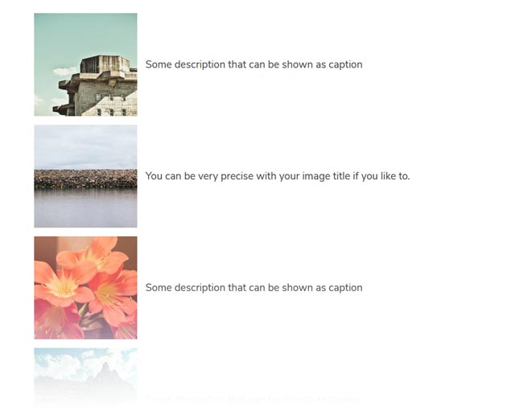

# Shortcode Gallery Plugin

## About

The **Shortcode Gallery** Plugin is an extension for [Grav CMS](http://github.com/getgrav/grav). A shortcode extension to add simple and customizable galleries to your grav website. It's targeting theme developers who seamlessly integrate CSS and JS assets for performance reasons.

It's a fork of [Shortcode Gallery++](https://github.com/sal0max/grav-plugin-shortcode-gallery-plusplus) to fit my personal likings.

Unlike the original there no special handling for feeds here, because disabling caching on pages and posts seems not be best option for me, so the feed will have to take the gallery markup as is.

## Usage

It's pretty straight forward. Just wrap some image links in `[gallery]` tags:

```markdown
[gallery]


...
[/gallery]
```

## Okay, what does it look like?

With the included CSS and JS you can get a basic experience with different layouts (which are of cause responsive). Be sure to activate the included CSS and JS in the plugin settings!

* You can of course create several galleries on the same page.
* You have plenty of settings you can change in the admin panel.
* You can also change everything for a single galleries via shortcode. For example:

```markdown
[gallery type=columns captions=true target_width=2560 target_height=1440]


...
[/gallery]
```




## Gallery Shortcode settings

| parameter   | possible values | description |
|-------------|-----------------| ------------|
| `type` | `grid`, `columns`, `list` | see images above
| `target_width` | dimension in pixel | width of the linked images
| `target_height` | dimension in pixel | height of the linked images
| `thumb_width` | dimension in pixel | width of the thumbnails
| `thumb_height` | dimension in pixel | height of the thumbnails
| `link` | `true`, `false` | link thumbnails to larger/original image
| `captions`  | `true`, `false` | show a caption (title) at the thumbnails
| `classes` | custom CSS class names | add your custom class names for special occurances

## Customization, CSS and JavaScript

You can use the included CSS and JS if you enable them in the plugins settings. But here is how you use it in you theme.

For using a different markup for you galleries, copy the templates from `user/plugins/shortcode-gallery/templates/shortcodes` to `user/themes/yourthemename/templates/shortcodes` (your theme) and customize according to need.

With custom (theme side) CSS and JS you can implement it in the bundling/processing you like. This will ensure you have full control over web performance, since you're not dependent on how the plugin includes multiple files, impacting the number and quality of requests to the server.

You can use the included CSS and JavaScript files as reference or starting point for your modifications. You don't need to use [Chocolat Lightbox](https://github.com/nicolas-t/Chocolat). You can use what ever lightbox you like and customize the templates as the library demands.

---

## Installation

This Plugin will not be published via GPM because it's meant to be a building block of your custom theme. It can run out of the box, but I prefer to use custom templates, CSS and JS.

### Manual Installation

> NOTE: This plugin is a modular component for Grav which requires the [Grav Shortcode Core Plugin](https://github.com/getgrav/grav-plugin-shortcode-core) to be installed.

To install the plugin manually, download the zip-version of this repository and unzip it under `/your/site/grav/user/plugins`. Then rename the folder to `shortcode-gallery`. You can find these files on [GitHub](https://github.com/bitstarr/grav-plugin-shortcode-gallery).

You can integrate this in your automated installation/deployments via the `user/.dependencies` file in your grav skeleton.

## Configuration

Before configuring this plugin, you should copy the `user/plugins/shortcode-gallery/shortcode-gallery.yaml` to `user/config/plugins/shortcode-gallery.yaml` and only edit that copy. The Settings can also be modified in the admin plugin.

Here a look a the default settings:

```yaml
enabled: true
built_in_css: false # use the included CSS
built_in_js: false # use included JS
default: grid # sets the default layout type(grid|columns|list)

target_width: 1920 # width of the linked larger image
target_height: 1080 # height ot the linked larger image
# set one of them to 0 to link to the original source

grid:
  thumb_width: 250 # thumbnail width
  thumb_height: 250 #thumbnail height
  captions: false # show a caption (title) at the thumbnail
  link: true # link to larger version (target)

columns:
  thumb_width: 500 # maximum thumbnail width
  thumb_height: null # needs to be set, ignore please
  captions: false # show a caption (title) at the thumbnail
  link: true # link to larger version (target)

list:
  thumb_width: 200 # thumbnail width
  thumb_height: 200 #thumbnail height
  captions: true # show a caption (title) at the thumbnail
  link: true # link to larger version (target)
```
---

## Credits

* [Chocolat Lightbox](https://github.com/nicolas-t/Chocolat)
* This plugin is based on [Shortcode Gallery++](https://github.com/sal0max/grav-plugin-shortcode-gallery-plusplus)